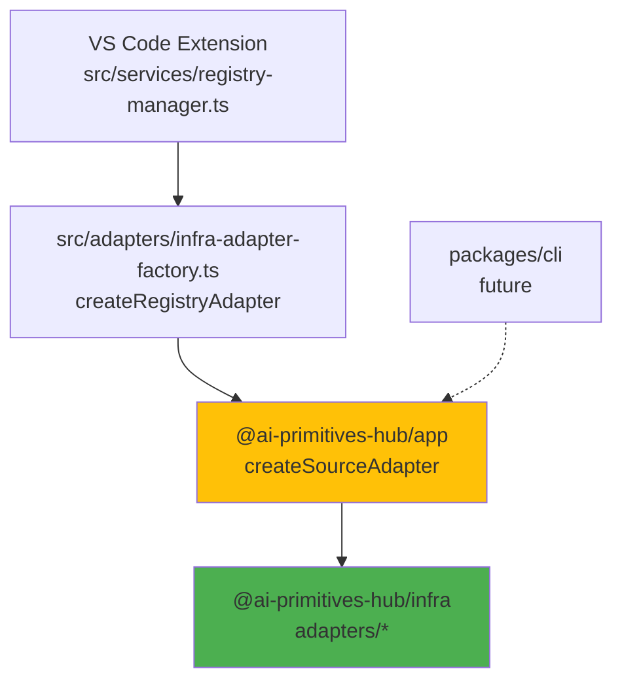

# Adapter Architecture

Adapters provide a unified interface for fetching bundles from different source types.

## Where Adapters Live

Concrete adapters live in `packages/infra/src/adapters/` (the `@ai-primitives-hub/infra` package), not in the extension's `src/adapters/`. This split exists so the same adapter code can be reused by both the VS Code extension and (eventually) `packages/cli`, without either depending on `vscode`:



- **`@ai-primitives-hub/infra`'s `adapters/*`** — the actual `fetchBundles`/`downloadBundle`/... implementations, depending only on `@ai-primitives-hub/core` ports (`HttpClient`, `FileSystem`, `Clock`, `TokenProvider`) for I/O.
- **`@ai-primitives-hub/app`'s `createSourceAdapter`** (`packages/app/src/registry/create-source-adapter.ts`) — maps a `RegistrySource` to the right concrete adapter, building whatever dependencies its constructor needs (e.g. a `GitHubApiClient` wired with a per-source `CompositeTokenProvider` for the four GitHub-hosted types). Shared by every delivery context.
- **The extension's `src/adapters/infra-adapter-factory.ts`'s `createRegistryAdapter`** — the one piece that *is* delivery-context-specific: it supplies the Node port implementations (`NodeFileSystem`, `SystemClock`, `NodeHttpClient`, `NodeProcessRunner`) and the extension's own auth fallback chain (`VsCodeSessionTokenProvider` then `GhCliTokenProvider`) that `createSourceAdapter` needs.

`src/adapters/`'s own eight adapter files were removed once `RegistryManager` was fully cut over to this factory chain — see `src/adapters/AGENTS.md` if you're wondering why the directory now contains far fewer files than this doc's history might suggest. The one survivor, `src/adapters/repository-adapter.ts`, keeps only the `IRepositoryAdapter` interface (identical in shape to `core`'s `SourceAdapter` port) as `createRegistryAdapter`'s return type.

## SourceAdapter Interface

```typescript
interface SourceAdapter {
    readonly type: string;
    readonly source: RegistrySource;
    fetchBundles(): Promise<Bundle[]>;
    downloadBundle(bundle: Bundle): Promise<Buffer>;
    fetchMetadata(): Promise<SourceMetadata>;
    validate(): Promise<ValidationResult>;
    requiresAuthentication(): boolean;
    getManifestUrl(bundleId: string, version?: string): string;
    getDownloadUrl(bundleId: string, version?: string): string;
    forceAuthentication?(): Promise<void>;
}
```

## Adapter Types

| Adapter | Source Type | Installation Method | Status |
|---------|-------------|---------------------|--------|
| **GitHubAdapter** | `github` | URL-based (getDownloadUrl) | Active |
| **LocalAdapter** | `local` | Buffer-based (downloadBundle) | Active |
| **AwesomeCopilotAdapter** | `awesome-copilot` | Buffer-based (builds zip on-the-fly) | Active |
| **LocalAwesomeCopilotAdapter** | `local-awesome-copilot` | Buffer-based | Active |
| **ApmAdapter** | `apm` | URL-based | Active |
| **LocalApmAdapter** | `local-apm` | Buffer-based | Active |
| **SkillsAdapter** | `skills` | Buffer-based | Active |
| **LocalSkillsAdapter** | `local-skills` | Buffer-based (symlink for local skills, see `RegistryManager.downloadAndInstall`) | Active |

Source types are defined in `packages/core/src/domain/source/types.ts`:
```typescript
export type SourceType = 'github' | 'local' | 
    'awesome-copilot' | 'local-awesome-copilot' | 'apm' | 'local-apm' |
    'skills' | 'local-skills';
```

## Two Installation Paths

**URL-Based** (`install()`):
- Pre-packaged zip bundles on remote servers
- Direct download from URL
- Used by: GitHub, ApmAdapter

**Buffer-Based** (`installFromBuffer()`):
- Dynamically created bundles
- Builds zip in memory
- Used by: AwesomeCopilot, Local, Skills

## Adding a New Adapter

See [Adapter API Reference](../../reference/adapter-api.md) for the full walkthrough. Summary:

```typescript
// 1. Implement SourceAdapter in packages/infra/src/adapters/my-adapter.ts
export class MyAdapter implements SourceAdapter {
    public readonly type = 'my-type';

    constructor(public readonly source: RegistrySource, /* injected core ports */) {}

    async fetchBundles(): Promise<Bundle[]> { /* ... */ }
    async downloadBundle(bundle: Bundle): Promise<Buffer> { /* ... */ }
    async fetchMetadata(): Promise<SourceMetadata> { /* ... */ }
    async validate(): Promise<ValidationResult> { /* ... */ }
    requiresAuthentication(): boolean { /* ... */ }
    getManifestUrl(bundleId: string, version?: string): string { /* ... */ }
    getDownloadUrl(bundleId: string, version?: string): string { /* ... */ }
}

// 2. Wire it into the one shared factory (packages/app/src/registry/create-source-adapter.ts)
case 'my-type':
    return new MyAdapter(source, /* deps */);

// 3. Add 'my-type' to the SourceType union in packages/core/src/domain/source/types.ts
```

No per-delivery-context registration step — the extension and `packages/cli` both call the same `createSourceAdapter`.

## See Also

- [Adapter API Reference](../../reference/adapter-api.md) — Full walkthrough for creating a new adapter
- [Authentication](./authentication.md) — Auth for private repos
- [Installation Flow](./installation-flow.md) — How bundles are installed
