# CLI User Flows and Command Architecture

This document provides a comprehensive view of the CLI command structure, user-facing use cases, and workflow diagrams.

## CLI Command Hierarchy

```mermaid
flowchart LR
    CLI[ai-primitives-hub]

    subgraph Init["Initialization"]
        direction TB
        init[init<br/>Bootstrap project]
    end

    subgraph Collection["Collection Management"]
        direction TB
        collCreate[collection create<br/>Scaffold collection]
        collValidate[collection validate<br/>Validate YAML]
        collList[collection list<br/>List collections]
        collAffected[collection affected<br/>Detect changes]
    end

    subgraph Scaffolding["Primitive Scaffolding"]
        direction TB
        promptCreate[prompt create<br/>Scaffold prompt]
        instrCreate[instruction create<br/>Scaffold instruction]
        agentCreate[agent create<br/>Scaffold agent]
        skillCreate[skill create<br/>Scaffold skill]
        skillNew[skill new<br/>New skill]
        skillValidate[skill validate<br/>Validate skill]
        pluginCreate[plugin create<br/>Scaffold plugin]
        hookCreate[hook create<br/>Scaffold hook]
    end

    subgraph Bundle["Bundle Management"]
        direction TB
        bundleBuild[bundle build<br/>Build bundle]
        bundleManifest[bundle manifest<br/>Generate manifest]
    end

    subgraph Hub["Hub Management"]
        direction TB
        hubAdd[hub add<br/>Import hub]
        hubList[hub list<br/>List hubs]
        hubUse[hub use<br/>Set active hub]
        hubRemove[hub remove<br/>Remove hub]
        hubCreate[hub create<br/>Scaffold hub config]
        hubSync[hub sync<br/>Sync hub]
        hubRefresh[hub refresh<br/>Refresh hub]
    end

    subgraph Source["Source Management"]
        direction TB
        sourceAdd[source add<br/>Add source]
        sourceList[source list<br/>List sources]
        sourceRemove[source remove<br/>Remove source]
    end

    subgraph Profile["Profile Management"]
        direction TB
        profileList[profile list<br/>List profiles]
        profileShow[profile show<br/>Show profile]
        profileActivate[profile activate<br/>Activate profile]
        profileDeactivate[profile deactivate<br/>Deactivate profile]
        profileCurrent[profile current<br/>Current profile]
        profileCreate[profile create<br/>Create profile]
        profileEdit[profile edit<br/>Edit profile]
        profilePublish[profile publish<br/>Publish profile]
    end

    subgraph Target["Target Management"]
        direction TB
        targetAdd[target add<br/>Add target]
        targetList[target list<br/>List targets]
        targetRemove[target remove<br/>Remove target]
        targetTypes[target types<br/>List types]
    end

    subgraph Index["Primitive Index"]
        direction TB
        indexBuild[index build<br/>Build index]
        indexHarvest[index harvest<br/>Harvest index]
        indexSearch[index search<br/>Search primitives]
        search[search<br/>Search alias]
        indexShortlist[index shortlist<br/>Manage shortlists]
        indexExport[index export<br/>Export profile]
        indexStats[index stats<br/>Index statistics]
        indexReport[index report<br/>Generate report]
        indexEval[index eval<br/>Evaluate search]
        indexBench[index bench<br/>Benchmark]
    end

    subgraph Install["Installation"]
        direction TB
        install[install<br/>Install bundle]
        uninstall[uninstall<br/>Uninstall bundle]
    end

    subgraph Other["Other Commands"]
        direction TB
        update[update<br/>Check updates]
        status[status<br/>Show status]
        doctor[doctor<br/>Health check]
        explain[explain<br/>Explain error]
        discover[discover<br/>Discover primitives]
        configGet[config get<br/>Get config]
        pluginsList[plugins list<br/>List plugins]
        versionCompute[version compute<br/>Compute version]
        apply[apply<br/>Apply changes]
    end

    CLI --> Init
    CLI --> Collection
    CLI --> Scaffolding
    CLI --> Bundle
    CLI --> Hub
    CLI --> Source
    CLI --> Profile
    CLI --> Target
    CLI --> Index
    CLI --> Install
    CLI --> Other

    Init --> init
    Collection --> collCreate
    Collection --> collValidate
    Collection --> collList
    Collection --> collAffected
    Scaffolding --> promptCreate
    Scaffolding --> instrCreate
    Scaffolding --> agentCreate
    Scaffolding --> skillCreate
    Scaffolding --> skillNew
    Scaffolding --> skillValidate
    Scaffolding --> pluginCreate
    Scaffolding --> hookCreate
    Bundle --> bundleBuild
    Bundle --> bundleManifest
    Hub --> hubAdd
    Hub --> hubList
    Hub --> hubUse
    Hub --> hubRemove
    Hub --> hubCreate
    Hub --> hubSync
    Hub --> hubRefresh
    Source --> sourceAdd
    Source --> sourceList
    Source --> sourceRemove
    Profile --> profileList
    Profile --> profileShow
    Profile --> profileActivate
    Profile --> profileDeactivate
    Profile --> profileCurrent
    Profile --> profileCreate
    Profile --> profileEdit
    Profile --> profilePublish
    Target --> targetAdd
    Target --> targetList
    Target --> targetRemove
    Target --> targetTypes
    Index --> indexBuild
    Index --> indexHarvest
    Index --> indexSearch
    Index --> search
    Index --> indexShortlist
    Index --> indexExport
    Index --> indexStats
    Index --> indexReport
    Index --> indexEval
    Index --> indexBench
    Install --> install
    Install --> uninstall
    Other --> update
    Other --> status
    Other --> doctor
    Other --> explain
    Other --> discover
    Other --> configGet
    Other --> pluginsList
    Other --> versionCompute
    Other --> apply
```

## User Use Cases and Flows

### Use Case 1: First-Time Setup

**Goal**: Set up ai-primitives-hub for a new project

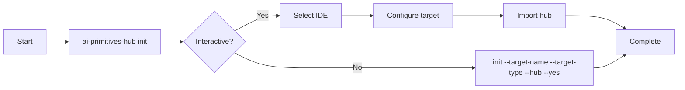

**Commands:**
- `ai-primitives-hub init` (interactive or with flags)
- Alternatively: `target add` + `hub add` + `hub use` + `hub sync`

---

### Use Case 2: Create a New Collection

**Goal**: Scaffold and publish a new prompt collection

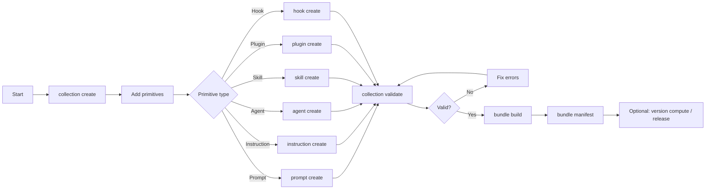

**Commands:**
- `collection create <id>`
- `prompt create <id>` / `instruction create <id>` / `agent create <id>` / `skill create <id>` / `plugin create <id>` / `hook create <id>`
- `collection validate <collection.yml>`
- `bundle build`
- `bundle manifest`
- `version compute --cwd` (for release tagging)

---

### Use Case 3: Hub-Based Profile Management

**Goal**: Import a hub and activate profiles

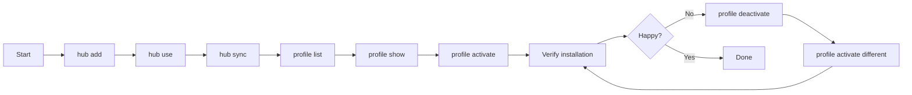

**Commands:**
- `hub add --type github --location owner/repo` (or `--type local --location ./path`)
- `hub use <hub-id>`
- `hub sync <hub-id>`
- `profile list [--hub <hub-id>]`
- `profile show <profile-id>`
- `profile activate <profile-id> --target <target-name>`
- `profile deactivate`

---

### Use Case 4: Primitive Discovery and Search

**Goal**: Find relevant primitives across sources

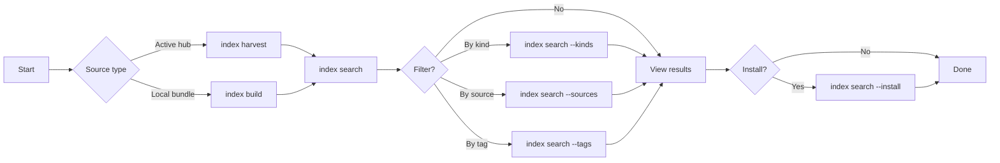

**Commands:**
- `index harvest` (auto-detects active hub)
- `index build --root <path> --out <file>`
- `index search --query <text> [--kinds <kinds>] [--sources <ids>] [--tags <tags>]`
- `index search --query <text> --install` (interactive install)

---

### Use Case 5: Custom Profile Creation

**Goal**: Create a custom profile from search results

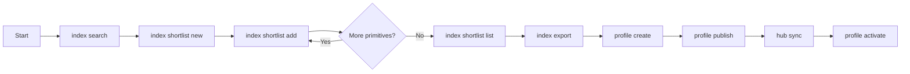

**Commands:**
- `index search --query <text>`
- `index shortlist new --name <name>`
- `index shortlist add --id <shortlist-id> --primitive <primitive-id>`
- `index shortlist list`
- `index export --shortlist <shortlist-id> --profile-id <profile-id> --out-dir <dir>`
- `profile create` (or edit exported profile)
- `profile publish`
- `hub sync <hub-id>`
- `profile activate <profile-id> --target <target-name>`

---

### Use Case 6: Direct Bundle Installation

**Goal**: Install a specific bundle without hub

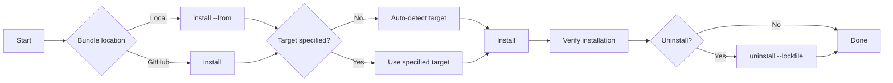

**Commands:**
- `install <bundle-id> --from <local-path> --target <target-name>`
- `install <owner/repo> --target <target-name>`
- `install` (auto-detects from lockfile)
- `uninstall --lockfile <path>`

---

### Use Case 7: Source Management (Default-Local Hub)

**Goal**: Manage detached sources without full hub

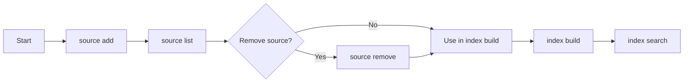

**Commands:**
- `source add --type github --url owner/repo [--id <id>] [--name <name>]`
- `source add --type local --url ./path [--id <id>]`
- `source list [--hub <hub-id>]`
- `source remove <source-id>`

---

### Use Case 8: Target Management

**Goal**: Configure installation targets

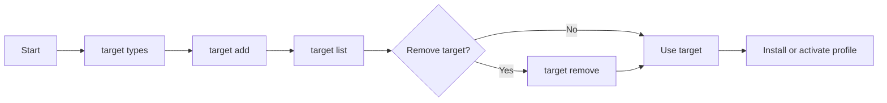

**Commands:**
- `target types` (list available target types)
- `target add <name> --type <type> --path <path> [--scope <scope>]`
- `target list`
- `target remove <name>`

---

### Use Case 9: Discovery and AI Assistance

**Goal**: Discover primitives with AI assistance

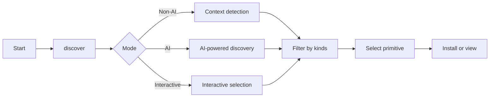

**Commands:**
- `discover` (non-AI mode with context detection)
- `discover --ai` (reserved for future Copilot SDK integration; currently fails)
- `discover --interactive` (reserved for future interactive selection; currently fails)
- `discover --kinds <kinds>` (filter by primitive kinds)
- `discover --limit <n>` (limit results)

---

### Use Case 10: Update and Maintenance

**Goal**: Check for updates and maintain system

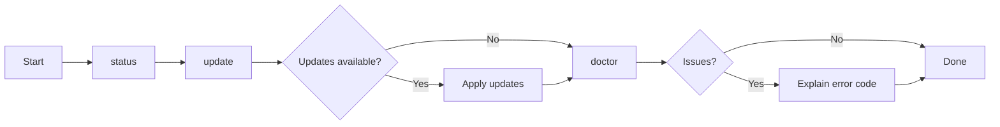

**Commands:**
- `status` (show current configuration)
- `update` (check for updates)
- `update --dry-run` (preview updates)
- `doctor` (health check)
- `explain <error-code>` (explain error codes)

---

### Use Case 11: Development and Debugging

**Goal:** Debug issues and inspect configuration

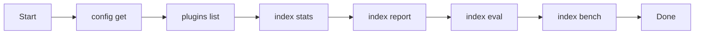

**Commands:**
- `config get <key>` (read configuration value)
- `plugins list` (list CLI plugins)
- `index stats` (show index statistics)
- `index report` (generate index report)
- `index eval` (evaluate search quality)
- `index bench` (benchmark search performance)

---

### Use Case 12: Collection Change Detection

**Goal:** Detect which collections changed between commits

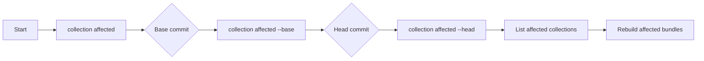

**Commands:**
- `collection affected --base <sha> --head <sha>`
- `collection affected --path <path>` (detect by path)

---

### Use Case 13: Version Computation

**Goal:** Compute next version for a collection

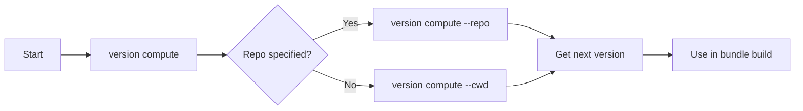

**Commands:**
- `version compute --repo <owner/repo> --collection <id>`
- `version compute --cwd` (auto-detect from git)

---

## Command Reference Summary

### Global Options
- `-o, --output <format>`: Output format (text, json, yaml, ndjson)
- `--verbose`: Verbose output
- `--help`: Show help

### Collection Commands
| Command | Purpose | Key Options |
|---------|---------|------------|
| `collection create <id>` | Scaffold new collection | `--path <dir>` |
| `collection validate <file>` | Validate collection YAML | `--strict` |
| `collection list` | List collections in repo | `--path <dir>` |
| `collection affected` | Detect changed collections | `--base <sha>`, `--head <sha>`, `--path <path>` |

### Scaffolding Commands
| Command | Purpose | Key Options |
|---------|---------|------------|
| `prompt create <id>` | Scaffold prompt | `--path <dir>` |
| `instruction create <id>` | Scaffold instruction | `--path <dir>` |
| `agent create <id>` | Scaffold agent | `--path <dir>` |
| `skill create <id>` | Scaffold skill | `--path <dir>` |
| `skill new <id>` | New skill (alternative) | `--path <dir>` |
| `skill validate <file>` | Validate skill | `--strict` |
| `plugin create <id>` | Scaffold plugin | `--path <dir>` |
| `hook create <id>` | Scaffold hook | `--path <dir>` |

### Bundle Commands
| Command | Purpose | Key Options |
|---------|---------|------------|
| `bundle build` | Build bundle ZIP | `--collection-file <path>`, `--version <version>`, `--out-dir <dir>`, `--repo-slug <slug>` |
| `bundle manifest` | Generate manifest | `--collection-file <path>`, `--version <version>`, `--out-file <path>` |

### Hub Commands
| Command | Purpose | Key Options |
|---------|---------|------------|
| `hub add` | Import hub | `--type <github\|local\|url>`, `--location <ref>`, `--ref <branch>`, `--id <id>`, `--no-sync`, `--no-use` |
| `hub list` | List hubs | `--check` |
| `hub use <id>` | Set active hub | `--clear` |
| `hub remove <id>` | Remove hub | |
| `hub create` | Scaffold hub config | `--out <dir>` |
| `hub sync [id]` | Sync hub | |
| `hub refresh [id]` | Refresh hub | |

### Source Commands
| Command | Purpose | Key Options |
|---------|---------|------------|
| `source add` | Add detached source | `--type <github\|local>`, `--url <ref>`, `--id <id>`, `--name <name>`, `--enabled` |
| `source list` | List sources | `--hub <hub-id>` |
| `source remove <id>` | Remove source | |

### Profile Commands
| Command | Purpose | Key Options |
|---------|---------|------------|
| `profile list` | List profiles | `--hub <hub-id>` |
| `profile show <id>` | Show profile details | `--hub <hub-id>` |
| `profile activate <id>` | Activate profile | `--hub <hub-id>`, `--target <name>`, `--dry-run` |
| `profile deactivate` | Deactivate profile | `--dry-run` |
| `profile current` | Show current profile | |
| `profile create` | Create profile | `--name <name>`, `--description <desc>` |
| `profile edit` | Edit profile | `--editor <cmd>` |
| `profile publish` | Publish profile | `--hub <hub-id>` |

### Target Commands
| Command | Purpose | Key Options |
|---------|---------|------------|
| `target add <name>` | Add target | `--type <type>`, `--path <path>`, `--scope <user\|repository>`, `--workspace-root <path>`, `--allowed-kinds <kinds>` |
| `target list` | List targets | |
| `target remove <name>` | Remove target | |
| `target types` | List target types | |

### Index Commands
| Command | Purpose | Key Options |
|---------|---------|------------|
| `index build` | Build index | `--root <path>`, `--out <file>`, `--source-id <id>` |
| `index harvest` | Harvest from hub | `--hub-repo <repo>`, `--hub-config-file <file>`, `--dry-run` |
| `index search` | Search primitives | `--query <text>`, `--index <file>`, `--kinds <kinds>`, `--sources <ids>`, `--bundles <ids>`, `--tags <tags>`, `--limit <n>`, `--offset <n>`, `--installed-only`, `--install` |
| `search` | Search alias | Same as `index search` |
| `index shortlist new` | Create shortlist | `--name <name>`, `--index <file>` |
| `index shortlist add` | Add to shortlist | `--id <shortlist-id>`, `--primitive <primitive-id>`, `--index <file>` |
| `index shortlist remove` | Remove from shortlist | `--id <shortlist-id>`, `--primitive <primitive-id>`, `--index <file>` |
| `index shortlist list` | List shortlists | `--index <file>` |
| `index export` | Export profile | `--shortlist <id>`, `--profile-id <id>`, `--out-dir <dir>`, `--index <file>` |
| `index stats` | Show statistics | `--index <file>` |
| `index report` | Generate report | `--index <file>`, `--out <file>` |
| `index eval` | Evaluate search | `--queries <file>`, `--index <file>` |
| `index bench` | Benchmark | `--index <file>`, `--queries <file>` |

### Install/Uninstall Commands
| Command | Purpose | Key Options |
|---------|---------|------------|
| `install [bundle]` | Install bundle | `--from <path>`, `--target <name>`, `--lockfile <path>`, `--dry-run` |
| `uninstall` | Uninstall bundle | `--lockfile <path>`, `--dry-run` |

### Other Commands
| Command | Purpose | Key Options |
|---------|---------|------------|
| `init` | Bootstrap project | `--target-name <name>`, `--target-type <type>`, `--hub <ref>`, `--hub-type <type>`, `--yes`, `--verbose` |
| `update` | Check updates | `--dry-run`, `--lockfile <path>` |
| `status` | Show status | |
| `doctor` | Health check | |
| `explain <code>` | Explain error | |
| `discover` | Discover primitives (context detection; `--ai` and `--interactive` reserved for future use) | `--kinds <kinds>`, `--limit <n>` |
| `config get <key>` | Get config value | |
| `plugins list` | List plugins | |
| `version compute` | Compute version | `--repo <owner/repo>`, `--collection <id>`, `--cwd` |
| `apply` | Apply changes | |

## See Also

- [Codemap](./codemap.md) — Package structure and dependencies
- [System Context](./system-context.md) — External relationships
- [Container Diagram](./container.md) — High-level containers
- [Component Diagrams](./component.md) — Detailed component views
