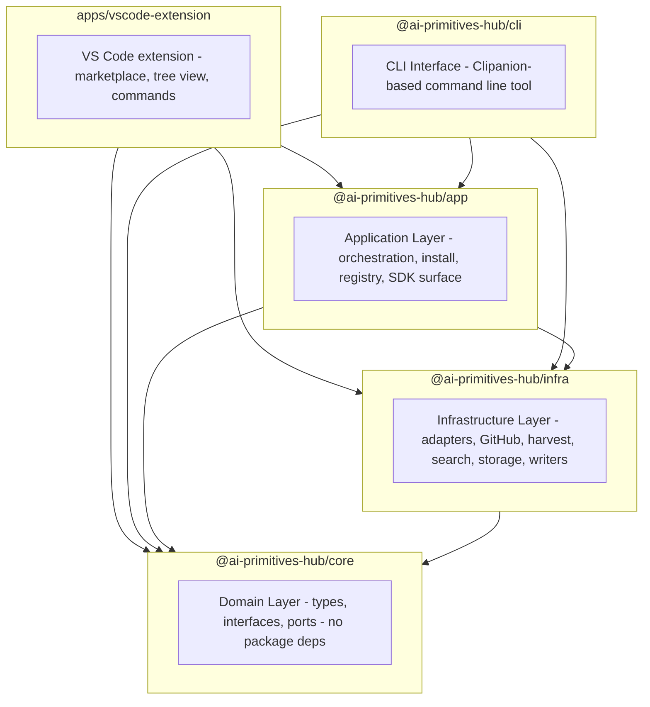

# Packages Architecture Codemap

This document provides a structural overview of the packages architecture in the AI Primitives Hub pnpm workspace.

## Package Dependency Graph

## Package Details

### @ai-primitives-hub/core (Domain Layer)

**Purpose**: Core domain types and port interfaces with minimal external dependencies.

**Dependencies**:
- `js-yaml` (schema parsing and YAML utilities)
- `semver` (version parsing and constraints)

**Key Modules**:
- `domain/` - Domain types and business logic
  - `bundle/` - Bundle types (`BundleManifest`, `BundleRef`, `HarvestedFile`, `BundleProvider`)
  - `collection/` - Collection types and validation
  - `discovery/` - Discovery types
  - `hub/` - Hub configuration types and validation
  - `install/` - Installation types (`Target`, `Installable`, `CopilotFileType`, layout, transforms)
  - `primitive/` - Primitive types
  - `registry/` - Registry configuration types, guards, and settings
  - `scaffold/` - Scaffolding types
  - `skill/` - Skill validation
  - `source/` - Source types
  - `source-id.ts` - Source ID utilities
  - `errors.ts` / `registry-error.ts` - Domain errors
- `ports/` - Port interfaces for external implementations
  - `filesystem.ts`, `http.ts`, `github-api.ts`, `clock.ts`, `process-runner.ts`
  - `bundle-downloader.ts`, `bundle-extractor.ts`, `source-adapter.ts`, `source-resolver.ts`
  - `target-writer.ts`, `layout-config-loader.ts`, `resource-transformer.ts`
  - `app-storage.ts` (universal XDG-based storage abstraction)
  - `registry-operations.ts`, `update-notifier.ts`, `update-store.ts`, `telemetry.ts`
- `public/` - Public APIs and schemas
  - `schemas/` - JSON schemas (`collection.schema.json`, etc.)

**Exports**:
- `SCHEMA_DIR` - Path to the schema directory
- `COLLECTION_SCHEMA` - Embedded collection schema JSON

**Design Principle**: Pure domain layer with no dependencies on other packages.

---

### @ai-primitives-hub/infra (Infrastructure Layer)

**Purpose**: Infrastructure adapters for external systems and shared services.

**Dependencies**:
- `@ai-primitives-hub/core` (workspace:*)
- `adm-zip` (ZIP extraction)
- `archiver` (ZIP creation)
- `js-yaml` (YAML parsing)
- `@elastic/elasticsearch` (optional telemetry transport)

**Key Modules**:
- `adapters/` - Source adapters (`LocalAdapter`, `GitHubAdapter`, `AwesomeCopilotAdapter`, `ApmAdapter`, `SkillsAdapter`, local variants)
- `auth/` - Token providers (`GhCliTokenProvider`, `StaticTokenProvider`)
- `clock/` - `SystemClock` implementation
- `downloaders/` - Bundle downloaders
- `extractors/` - Bundle extraction (`AdmZipBundleExtractor`)
- `fs/` - `FileSystem` port adapter
- `harvest/` - Bundle discovery and harvesting
  - Bundle providers, tree enumerators, `Harvester`, `HubHarvester`
  - `blob-cache.ts`, `etag-store.ts`, `progress-log.ts`, `integrity.ts`, `default-paths.ts`
- `http/` - `NodeHttpClient` and GitHub host helpers
- `hub/` - Hub config parsing
- `process/` - `NodeProcessRunner` implementation
- `resolvers/` - Path resolution helpers
- `scaffolding/` - `TemplateEngine` and template files
- `search/` - BM25 search engine, `PrimitiveIndex`, tokenizer, tuning
- `storage/` - Index storage utilities
- `stores/` - JSON lockfile, target-state, and layout-config stores
- `telemetry/` - Telemetry and optional Elasticsearch transport
- `transports/` - Telemetry transport abstractions
- `writers/` - Per-target file writing (`FileTreeTargetWriter`) and `default-layouts.json`

**Exports**:
- `TEMPLATE_ROOT` / `TEMPLATE_PATHS` - Template directory paths
- `defaultLayouts` - Built-in target layouts
- `NodeHttpClient`, `FileSystem`, `SystemClock`, `GitHubApiClient` - Concrete adapters

**Design Principle**: Infrastructure implementations depend only on `core` domain types and ports.

---

### @ai-primitives-hub/app (Application Layer)

**Purpose**: Use-case orchestration and the public SDK surface until a dedicated SDK package is needed.

**Dependencies**:
- `@ai-primitives-hub/core` (workspace:*)
- `@ai-primitives-hub/infra` (workspace:*)
- `js-yaml` (YAML parsing)

**Key Modules**:
- `collection/` - Collection reading and validation
- `context-detection/` - Repository context detection
- `discovery/` - Discovery orchestration
- `install/` - Installation orchestration
  - `install-bundle.ts`, `uninstall-bundle.ts`, `pipeline.ts`
  - `layout-resolver.ts` - Layout configuration resolution
- `registry/` - Registry management (hub, profile, activation, user config paths)
- `search/` - Search orchestration
- `transform/` - Multi-target content transforms (`kiro-transformer`, windsurf/devin, claude-code)
- `writers/` - Application-level writers
- `stores/` - Application-level stores
- `update/` - Update orchestration

**Design Principle**: Application layer orchestrates infrastructure adapters for business use cases and exposes the public SDK surface.

---

### @ai-primitives-hub/cli (CLI Layer)

**Purpose**: CLI interface for end users using the Clipanion framework.

**Dependencies**:
- `@ai-primitives-hub/app` (workspace:*)
- `@ai-primitives-hub/core` (workspace:*)
- `@ai-primitives-hub/infra` (workspace:*)
- `clipanion` (CLI framework — pinned to `4.0.0-rc.4`)
- `inquirer` (interactive prompts)
- `archiver` (ZIP creation)
- `semver` (version management)
- `typanion` (validation)
- `js-yaml` (YAML parsing)

**Key Modules**:
- `commands/` - CLI command implementations
  - Collection commands (`collection-create`, `collection-validate`, `collection-list`, `collection-affected`)
  - Primitive scaffolding (`prompt-create`, `instruction-create`, `agent-create`, `skill-create`, `skill-new`, `skill-validate`, `plugin-create`, `hook-create`)
  - Bundle commands (`bundle-build`, `bundle-manifest`)
  - Hub commands (`hub add/list/use/remove/create/sync/refresh`)
  - Source commands (`source add/list/remove`)
  - Profile commands (`profile list/show/activate/deactivate/current/create/edit/publish`)
  - Target commands (`target add/list/remove/types`)
  - Index commands (`index build/harvest/search/shortlist/export/stats/report/eval/bench`)
  - Install commands (`install`, `uninstall`, `update`, `apply`)
  - Utility commands (`init`, `status`, `doctor`, `explain`, `discover`, `config get/list`, `plugins list`, `version compute`, `completion`)
- `framework/` - CLI framework abstractions
  - `command-class.ts` - Command base class
  - `error.ts` - Error handling
  - `output.ts` - Output formatting
  - `context.ts` - I/O abstraction
- `validate.ts` - Collection validation utilities
- `collections.ts` - Collection utilities
- `skills.ts` - Skill utilities
- `cli.ts` - CLI entry point
- `main.ts` - Main entry point

**Binary**: `ai-primitives-hub`

**Design Principle**: CLI layer provides thin, user-facing commands that delegate all business logic to `app`.

---

### apps/vscode-extension (VS Code Extension)

**Purpose**: VS Code extension delivering the AI Primitives Hub marketplace, tree view, and IDE commands.

**Dependencies**:
- `@ai-primitives-hub/app` (workspace:*)
- `@ai-primitives-hub/core` (workspace:*)
- `@ai-primitives-hub/infra` (workspace:*)
- `vscode` APIs

**Key Modules**:
- `src/commands/` - VS Code command handlers
- `src/services/` - Extension-specific services (being migrated to `app` via strangler fig)
- `src/ui/` - Marketplace webview and tree view
- `src/storage/` - Persistent state management
- `src/adapters/` - Source-specific adapters

**Design Principle**: The extension is a delivery mechanism; business logic is shared through `app`/`core`/`infra`.

---

## Layering Principles

1. **Domain Layer (core)**: No dependencies on other packages. Pure types and interfaces.
2. **Infrastructure Layer (infra)**: Depends only on core. Implements external integrations.
3. **Application Layer (app)**: Depends on core and infra. Orchestrates business logic and serves as the public SDK surface.
4. **CLI Layer (cli)**: Depends on core, infra, and app. Provides user interface.
5. **VS Code Extension (apps/vscode-extension)**: Depends on core, infra, and app. Provides IDE integration.

## Cross-Package Boundaries

The architecture enforces clear boundaries:
- Template paths are exported from `@ai-primitives-hub/infra` via `TEMPLATE_PATHS`
- Default layouts are exported from `@ai-primitives-hub/infra` via `defaultLayouts`
- Schema paths are exported from `@ai-primitives-hub/core` via `SCHEMA_DIR`
- `COLLECTION_SCHEMA` is embedded in `@ai-primitives-hub/core` for single-executable apps
- No hardcoded relative paths across package boundaries
- Each package has its own build process with resource copying as needed

## See Also

- [Clean Architecture](./clean-architecture.md) — Clean Architecture principles and how they apply to AI Primitives Hub
- [System Context](./system-context.md) — External relationships and user personas
- [Container Diagram](./container.md) — High-level containers and technology choices
- [Component Diagrams](./component.md) — Detailed component views
