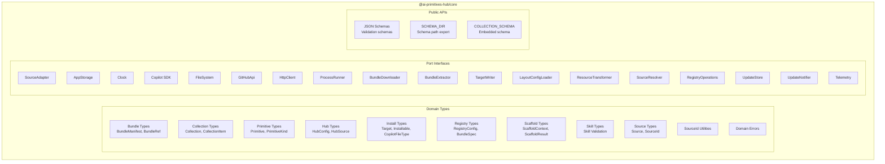
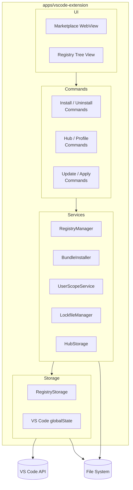
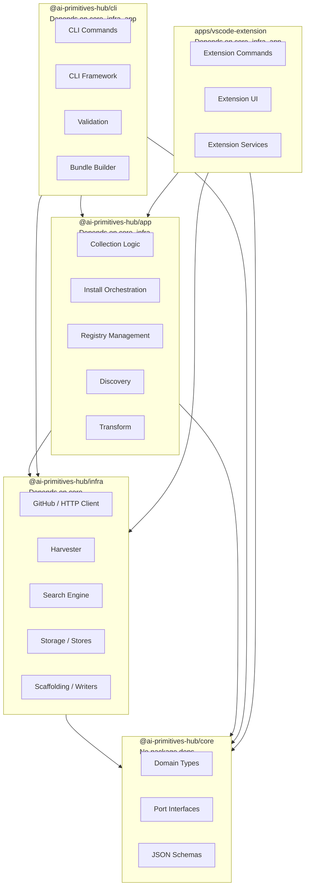

# Component Diagrams (Level 3)

Detailed component diagrams for key subsystems within the AI Primitives Hub packages.

## CLI Package Components

```mermaid
flowchart TB
    subgraph CLI["@ai-primitives-hub/cli"]
        subgraph Commands["CLI Commands"]
            collCmd[Collection Commands<br/>create, validate, list, affected]
            primCmd[Primitive Commands<br/>prompt, instruction, agent, skill, plugin, hook]
            bundleCmd[Bundle Commands<br/>build, manifest]
            initCmd[Init Command<br/>Initialize project]
            sourceCmd[Source Commands<br/>add, list, remove]
            hubCmd[Hub Commands<br/>add, use, list, remove, create, sync, refresh]
            profileCmd[Profile Commands<br/>list, show, activate, deactivate, create, edit, publish]
            targetCmd[Target Commands<br/>add, list, remove, types]
            indexCmd[Index Commands<br/>build, harvest, search, shortlist, export, stats, report, eval, bench]
            installCmd[Install Commands<br/>install, uninstall, update, apply]
            utilCmd[Utility Commands<br/>status, doctor, explain, discover, config, version compute, completion]
        end

        subgraph Framework["CLI Framework"]
            ctx[Context<br/>I/O abstraction]
            err[RegistryError<br/>Structured errors]
            fmt[Formatters<br/>Output formatting]
            cmdClass[Command Class<br/>Base class]
            cfg[Config Loader<br/>Target/config loading]
        end

        subgraph Validation["Validation"]
            collVal[Collection Validation<br/>YAML schema validation]
        end

        subgraph Builder["Bundle Builder"]
            zipBuilder[ZIP Builder<br/>Deterministic bundle creation]
        end
    end

    FS[(File System<br/>Node.js fs)]

    collCmd --> ctx
    collCmd --> err
    collCmd --> fmt
    collCmd --> collVal

    primCmd --> ctx
    primCmd --> err
    primCmd --> fmt

    bundleCmd --> ctx
    bundleCmd --> err
    bundleCmd --> fmt
    bundleCmd --> zipBuilder

    initCmd --> ctx
    initCmd --> err
    initCmd --> fmt

    sourceCmd --> ctx
    sourceCmd --> err
    sourceCmd --> fmt

    hubCmd --> ctx
    hubCmd --> err
    hubCmd --> fmt

    profileCmd --> ctx
    profileCmd --> err
    profileCmd --> fmt

    targetCmd --> ctx
    targetCmd --> err
    targetCmd --> fmt

    indexCmd --> ctx
    indexCmd --> err
    indexCmd --> fmt

    installCmd --> ctx
    installCmd --> err
    installCmd --> fmt

    utilCmd --> ctx
    utilCmd --> err
    utilCmd --> fmt

    ctx --> FS
    cfg --> FS
    collVal --> FS
    zipBuilder --> FS
```

### Key Components

| Component | Responsibility | Key Files |
|-----------|----------------|-----------|
| Collection Commands | Collection scaffolding, validation, and change detection | `collection-create.ts`, `collection-validate.ts`, `collection-list.ts`, `collection-affected.ts` |
| Primitive Commands | Primitive scaffolding (7 types) | `prompt-create.ts`, `instruction-create.ts`, `agent-create.ts`, `skill-create.ts`, `skill-new.ts`, `skill-validate.ts`, `plugin-create.ts`, `hook-create.ts` |
| Bundle Commands | Bundle building and manifest generation | `bundle-build.ts`, `bundle-manifest.ts` |
| Init Command | Project initialization and first target setup | `init.ts` |
| Source Commands | Detached source management | `source.ts` |
| Hub Commands | Hub import, activation, and sync | `hub.ts` |
| Profile Commands | Profile listing, activation, and publishing | `profile.ts` |
| Target Commands | Target configuration | `target-add.ts`, `target-list.ts`, `target-remove.ts`, `target-types.ts` |
| Index Commands | Primitive index/search/shortlist | `index-build.ts`, `index-harvest.ts`, `index-search.ts`, `index-shortlist.ts`, etc. |
| Install Commands | Bundle install, uninstall, update, apply | `install.ts`, `uninstall.ts`, `update.ts`, `apply.ts` |
| Utility Commands | Status, diagnostics, discovery, config, version | `status.ts`, `doctor.ts`, `explain.ts`, `discover.ts`, `config-get.ts`, `config-list.ts`, `version-compute.ts`, `completion.ts` |
| CLI Framework | I/O abstraction, error handling, output formatting, command base class, config loading | `framework/cli.ts`, `framework/context.ts`, `framework/error.ts`, `framework/output.ts`, `framework/command-class.ts`, `framework/config.ts` |
| Collection Validation | YAML schema validation | `validate.ts` |
| Bundle Builder | Deterministic ZIP creation | `bundle-build.ts` |

---

## Infra Package Components

```mermaid
flowchart TB
    subgraph Infra["@ai-primitives-hub/infra"]
        subgraph Auth["Authentication"]
            tokenProvider[Token Provider<br/>env / gh CLI / static]
            composite[Composite Provider<br/>Strategy chain]
        end

        subgraph HTTP["HTTP / GitHub"]
            httpClient[NodeHttpClient<br/>Redirects + proxies]
            ghClient[GitHubApiClient<br/>Rate limit + retry]
            ghHost[GitHub Host Helper<br/>Host predicates]
        end

        subgraph Adapters["Source Adapters"]
            local[LocalAdapter]
            github[GitHubAdapter]
            awesome[AwesomeCopilotAdapter]
            apm[ApmAdapter]
            skills[SkillsAdapter]
            localVariants[Local variants]
        end

        subgraph Harvester["Harvester"]
            harvester[Harvester<br/>Bundle discovery]
            hubHarvester[HubHarvester<br/>Hub-wide harvesting]
            providers[Bundle Providers]
            treeEnum[Tree Enumerator]
            extractor[Extractor<br/>Primitive extraction]
            blobCache[Blob Cache]
            etagStore[ETag Store]
            progressLog[Progress Log]
        end

        subgraph Search["Search Engine"]
            bm25[BM25 Engine<br/>Scoring]
            tokenizer[Tokenizer]
            tuning[Tuning]
            primitiveIndex[PrimitiveIndex<br/>Search API]
            types[Search Types]
        end

        subgraph Storage["Storage"]
            indexStore[JSON Index Store]
            xdgAppStorage[XdgAppStorage<br/>XDG storage]
            xdgBaseDirs[XDG Base Dirs]
        end

        subgraph Stores["State Stores"]
            lockfile[JSON Lockfile Store]
            targetState[Target State Store]
            layoutConfig[Layout Config Store]
            activeHub[Active Hub Store]
            profileActivation[Profile Activation Store]
        end

        subgraph Scaffolding["Scaffolding"]
            templateEngine[Template Engine]
            templates[Template Files<br/>7 primitive types]
        end

        subgraph Writers["Writers"]
            fileTreeWriter[FileTreeTargetWriter<br/>Per-target writing]
            zipWriter[ZipWriter]
            repoWriter[RepoScopeWriter]
            defaultLayouts[Default Layouts]
        end

        subgraph Downloaders["Downloaders"]
            assetFetcher[Asset Fetcher<br/>Release downloads]
        end

        subgraph Extractors["Extractors"]
            zipExtractor[AdmZipBundleExtractor]
        end

        subgraph Clock["Clock"]
            systemClock[SystemClock]
        end
    end

    GitHubAPI[(GitHub API<br/>HTTPS)]
    FS[(File System<br/>Node.js fs)]

    tokenProvider --> composite
    composite --> ghClient
    ghClient --> httpClient
    httpClient --> GitHubAPI

    Adapters --> ghClient
    Adapters --> httpClient
    Adapters --> FS

    harvester --> Adapters
    harvester --> extractor
    harvester --> blobCache
    harvester --> etagStore
    harvester --> progressLog
    hubHarvester --> harvester
    hubHarvester --> ghClient
    providers --> harvester
    treeEnum --> ghClient

    searchOrch --> bm25
    searchOrch --> facets
    searchOrch --> indexStore

    bm25 --> tokenizer
    bm25 --> tuning
    primitiveIndex --> bm25
    primitiveIndex --> Stores

    xdgAppStorage --> xdgBaseDirs
    xdgAppStorage --> FS

    Stores --> FS
    Storage --> FS
    indexStore --> FS

    Scaffolding --> FS
    Writers --> FS
    Extractors --> FS
    Downloaders --> ghClient
    Downloaders --> GitHubAPI
```

### Key Components

| Component | Responsibility | Key Files |
|-----------|----------------|-----------|
| TokenProvider | Auth token resolution (env, `gh`, static) | `auth/*` |
| NodeHttpClient | Node `http`/`https` client with redirects and credential stripping | `http/node-http-client.ts` |
| GitHubApiClient | GitHub API with retry, rate-limit handling, and ETag support | `http/github-api-client.ts` |
| Source Adapters | `SourceAdapter` implementations for local and remote sources | `adapters/*` |
| Harvester | Bundle discovery and primitive extraction | `harvest/harvester.ts`, `harvest/extractor.ts` |
| HubHarvester | Hub-wide harvesting pipeline | `harvest/hub-harvester.ts` |
| BM25 Engine | Full-text search scoring | `search/bm25-engine.ts` |
| PrimitiveIndex | Search API with faceting and BM25 scoring | `search/primitive-index.ts` |
| JSON Index Store | Persist primitive index to JSON | `stores/json-index-store.ts` |
| XdgAppStorage | XDG Base Directory-compliant `AppStorage` adapter | `storage/xdg-app-storage.ts` |
| State Stores | Lockfile, target-state, active hub, profile activation | `stores/*` |
| FileTreeTargetWriter | Per-target file writing with layout routing | `writers/file-tree-target-writer.ts` |
| Default Layouts | Built-in target layouts for vscode, vscode-insiders, copilot-cli, kiro, windsurf, claude-code | `writers/default-layouts.json` |
| Template Engine | Handlebars template rendering | `scaffolding/template-engine.ts` |
| Asset Fetcher | Release asset downloading | `downloaders/*` |
| AdmZipBundleExtractor | ZIP bundle extraction | `extractors/*` |
| SystemClock | `Clock` port implementation | `clock/system-clock.ts` |

---

## App Package Components

```mermaid
flowchart TB
    subgraph App["@ai-primitives-hub/app"]
        subgraph Collection["Collection Logic"]
            readColl[Read Collection<br/>Parse and validate]
            genSkill[Generate Skill<br/>Skill generation]
        end

        subgraph Install["Install Orchestration"]
            installBundle[Install Bundle<br/>Installation logic]
            uninstallBundle[Uninstall Bundle<br/>Uninstallation logic]
            installPipeline[Install Pipeline<br/>Orchestration]
            uninstallPipeline[Uninstall Pipeline<br/>Orchestration]
            layoutResolver[Layout Resolver<br/>Layout configuration]
        end

        subgraph Registry["Registry Management"]
            hubMgr[Hub Manager<br/>Hub configuration]
            profileActivator[Profile Activator<br/>Profile logic]
            userConfigPaths[User Config Paths<br/>Configuration paths]
            detectUpdates[Detect Updates]
            resolveBundle[Resolve Bundle]
            lifecycle[Profile Lifecycle]
        end

        subgraph ContextDetection["Context Detection"]
            detector[ContextDetector<br/>Repository detection]
        end

        subgraph Discovery["Discovery"]
            profileGen[Profile Generator]
            recommendation[Recommendation Engine]
        end

        subgraph Transform["Multi-Target Transform"]
            registry[TransformerRegistry]
            kiro[Kiro Transformer]
            windsurf[Windsurf / Devin Transformer]
            claude[Claude Code Transformer]
            noop[Noop Transformer]
        end

        subgraph Search["Search Orchestration"]
            exportProfile[Export Profile from Shortlist]
        end

        subgraph Writers["App Writers"]
            fileTreeWriter[FileTreeTargetWriter]
        end

        subgraph Stores["App Stores"]
            lockfileStore[JSON Lockfile Store]
        end

        subgraph Update["Update"]
            checkUpdates[Check Updates]
            autoUpdate[Auto Update]
            logEvent[Log Event]
        end
    end

    FS[(File System<br/>Node.js fs)]

    readColl --> FS
    genSkill --> FS

    installBundle --> FS
    uninstallBundle --> FS
    installPipeline --> FS
    uninstallPipeline --> FS
    layoutResolver --> FS

    hubMgr --> FS
    profileActivator --> FS
    userConfigPaths --> FS
    detectUpdates --> FS
    resolveBundle --> FS
    lifecycle --> FS

    detector --> FS
    profileGen --> FS
    recommendation --> FS

    registry --> kiro
    registry --> windsurf
    registry --> claude
    registry --> noop

    exportProfile --> FS
    fileTreeWriter --> FS
    lockfileStore --> FS
    checkUpdates --> FS
    autoUpdate --> FS
    logEvent --> FS
```

### Key Components

| Component | Responsibility | Key Files |
|-----------|----------------|-----------|
| Read Collection | Parse and validate collection YAML | `collection/read-collection.ts` |
| Generate Skill | Generate skill from collection | `collection/generate-skill.ts` |
| Install Bundle | Bundle installation logic | `install/install-bundle.ts` |
| Uninstall Bundle | Bundle uninstallation logic | `install/uninstall-bundle.ts` |
| Install Pipeline | Installation orchestration | `install/pipeline.ts` |
| Uninstall Pipeline | Uninstallation orchestration | `install/uninstall-pipeline.ts` |
| Layout Resolver | Layout configuration resolution | `install/layout-resolver.ts` |
| Hub Manager | Hub configuration management | `registry/hub-manager.ts` |
| Profile Activator | Profile activation logic | `registry/activate-registry-profile.ts` |
| User Config Paths | User configuration paths | `registry/user-config-paths.ts` |
| Detect Updates | Detect bundle updates | `registry/detect-updates.ts` |
| Resolve Bundle | Resolve bundle for install | `registry/resolve-installation-bundle.ts` |
| Profile Lifecycle | Create/edit/delete profiles | `registry/profile-lifecycle.ts` |
| Context Detector | Repository context detection | `context-detection/detector.ts` |
| Profile Generator | Generate profile from context | `discovery/profile-generator.ts` |
| Recommendation Engine | Recommend primitives from context | `discovery/recommendation-engine.ts` |
| Transformer Registry | Registry of per-target content transformers | `transform/transformer-registry.ts` |
| Kiro Transformer | Kiro-specific content transform | `transform/transformers/kiro-transformer.ts` |
| Windsurf Transformer | Windsurf / Devin transform | `transform/transformers/windsurf-transformer.ts` |
| Claude Code Transformer | Claude Code transform | `transform/transformers/claude-code-transformer.ts` |
| Export Profile | Export shortlist to profile | `search/export-profile.ts` |
| FileTreeTargetWriter | App-level writer composition | `writers/file-tree-writer.ts` |
| JSON Lockfile Store | App-level lockfile store | `stores/json-lockfile-store.ts` |
| Check Updates | Update checking orchestration | `update/check-updates.ts` |
| Auto Update | Auto-update orchestration | `update/auto-update.ts` |

---

## Core Package Components

### Key Components

| Component | Responsibility | Key Files |
|-----------|----------------|-----------|
| Bundle Types | Bundle metadata, references, harvested files, providers | `domain/bundle/` |
| Collection Types | Collection structure, items, validation, manifest validation | `domain/collection/` |
| Primitive Types | Primitive union, kinds, and searchable fields | `domain/primitive/` |
| Hub Types | Hub configuration, sources, and validation | `domain/hub/` |
| Install Types | Installation targets, installables, layouts, transforms, copilot file type | `domain/install/` |
| Registry Types | Registry configuration, settings, and guards | `domain/registry/` |
| Scaffold Types | Scaffolding context and results | `domain/scaffold/` |
| Skill Types | Skill metadata and validation | `domain/skill/validate.ts` |
| Source Types | Source definitions and `SourceId` utilities | `domain/source/`, `domain/source-id.ts` |
| Domain Errors | Registry and domain errors | `domain/errors.ts`, `domain/registry-error.ts` |
| Port Interfaces | Abstractions for implementations | `ports/` |
| JSON Schemas | Validation schemas | `public/schemas/collection.schema.json` |
| SCHEMA_DIR | Exported schema directory path | `index.ts` |
| COLLECTION_SCHEMA | Embedded collection schema JSON | `index.ts` |

---

## VS Code Extension Components

### Key Components

| Component | Responsibility | Key Files |
|-----------|----------------|-----------|
| Install Commands | Install/uninstall bundles from the IDE | `src/commands/install*.ts` |
| Hub/Profile Commands | Manage hubs and profiles | `src/commands/hub-profile-commands.ts` |
| Update Commands | Check and apply updates | `src/commands/update*.ts` |
| Marketplace WebView | Bundle marketplace UI | `src/ui/marketplace/*` |
| Registry Tree View | Tree view of installed sources and bundles | `src/ui/tree-view/*` |
| RegistryManager | Coordinates adapters, storage, and installer | `src/services/registry-manager.ts` |
| BundleInstaller | Download, extract, validate, and install bundles | `src/services/bundle-installer.ts` |
| UserScopeService | User-scope primitive sync with layout and transforms | `src/services/user-scope-service.ts` |
| LockfileManager | Repository lockfile management | `src/services/lockfile-manager.ts` |
| HubStorage | Hub persistent storage | `src/storage/hub-storage.ts` |
| RegistryStorage | VS Code globalStorage-based state | `src/storage/registry-storage.ts` |

**Note**: The extension is being migrated onto `app`/`core`/`infra` through a strangler-fig approach (see [ADR-0001](../adr/0001-ports-and-adapters-for-cli-and-extension.md)); the `Services` layer is becoming thin delegators over the shared `app` use cases.

---

## Component Dependencies

**Key Rule**: Core has no package dependencies. Infra depends only on Core. App depends on Core and Infra. CLI and the VS Code extension depend on Core, Infra, and App. App also serves as the public SDK surface.

## See Also

- [Codemap](./codemap.md) — Package structure and dependencies
- [System Context](./system-context.md) — External relationships
- [Container Diagram](./container.md) — High-level containers
