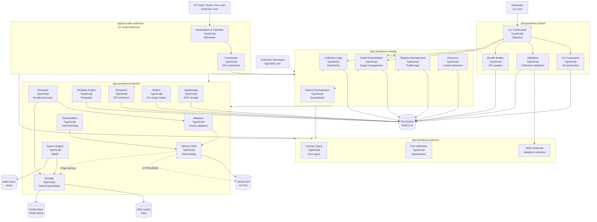

# Container Diagram (Level 2)

The Container diagram shows the high-level technology choices and how responsibilities are distributed across the AI Primitives Hub pnpm workspace.

## Diagram

## Container Descriptions

### @ai-primitives-hub/core (Domain Layer)
Pure domain types and interfaces with no external dependencies:
- **Domain Types**: Bundle, Collection, Primitive, Hub, Install, Registry, Source, Scaffold, Skill types
- **Port Interfaces**: Abstractions for external implementations (`FileSystem`, `HttpClient`, `GitHubApi`, `TargetWriter`, `BundleDownloader`, `BundleExtractor`, `SourceAdapter`, `ResourceTransformer`, `AppStorage`, etc.)
- **JSON Schemas**: Validation schemas for collections and hubs
- **Exports**: `SCHEMA_DIR`, `COLLECTION_SCHEMA`

**Technology**: TypeScript, js-yaml, semver

### @ai-primitives-hub/infra (Infrastructure Layer)
Infrastructure adapters for external integrations:
- **Adapters**: Source adapters (`Local`, `GitHub`, `AwesomeCopilot`, `Apm`, `Skills`, local variants)
- **GitHub Client**: API integration with rate limiting, retry, and ETag caching
- **Harvester**: Bundle discovery from hub sources
- **Search Engine**: BM25 full-text search with faceted filtering
- **Storage**: Index store (JSON), blob cache, JSON lockfile, target-state, layout-config stores
- **AppStorage**: XDG Base Directory-compliant storage abstraction
- **Template Engine**: Scaffolding templates for all primitive types
- **Downloaders**: Asset downloading from GitHub releases
- **Extractors**: ZIP bundle extraction
- **Writers**: Per-target file writing and default layouts
- **Exports**: `TEMPLATE_ROOT`, `TEMPLATE_PATHS`, `defaultLayouts`, concrete adapters

**Technology**: TypeScript, adm-zip, archiver, js-yaml

### @ai-primitives-hub/app (Application Layer + SDK Surface)
Orchestration of business logic and the public SDK surface until a dedicated SDK package is needed:
- **Collection Logic**: Reading and validating collection files
- **Install Orchestration**: Target management, multi-target bundle installation, and transforms
- **Registry Management**: Hub, profile, activation, and user config paths
- **Discovery**: Repository context detection and primitive discovery
- **Search Orchestration**: Query/facet orchestration over the infra search engine

**Technology**: TypeScript, js-yaml

### @ai-primitives-hub/cli (CLI Layer)
User-facing CLI interface using the Clipanion framework (pinned to `4.0.0-rc.4`):
- **CLI Commands**: collection, bundle, init, source, hub, profile, target, index, install, status, update, doctor, discover, and scaffolding commands
- **CLI Framework**: I/O abstraction, error handling, output formatting
- **Validation**: Collection YAML validation
- **Bundle Builder**: Deterministic ZIP bundle creation

**Technology**: TypeScript, Clipanion, inquirer, archiver, semver, typanion, js-yaml

### apps/vscode-extension (VS Code Extension)
IDE extension that exposes the same domain through VS Code UI:
- **Commands**: VS Code command palette and tree view handlers
- **Marketplace & TreeView**: Webview-based marketplace and sidebar tree view

**Technology**: TypeScript, VS Code API

## Container Relationships

| From | To | Relationship |
|------|-----|--------------|
| CLI | Framework | Uses for I/O abstraction |
| CLI | Validation | Validates collections |
| CLI | Builder | Creates bundles |
| CLI | App | Uses for business logic |
| CLI | Core | Uses for domain types |
| CLI | Infra | Uses for infrastructure |
| Extension | App | Uses for business logic |
| Extension | Core | Uses for domain types |
| Extension | Infra | Uses for infrastructure adapters |
| App | Infra | Uses for infrastructure implementations |
| App | Core | Uses for domain types |
| Infra | Core | Uses for domain types |
| Adapters | GitHub | Fetches content |
| Harvester | Adapters | Discovers bundles |
| Search | Stores | Uses for index/cache |
| GitHub | Stores | Uses for ETag caching |

## Technology Choices

| Component | Technology | Rationale |
|-----------|-----------|-----------|
| Language | TypeScript | Type safety, VS Code ecosystem |
| Runtime | Node.js 22+ | Matches CI and pnpm toolchain |
| Package Manager | pnpm 11.5.0 | Workspace protocol and lockfile stability |
| Monorepo | pnpm workspace (`packages/*`, `apps/*`, `github-actions/*`, `lib`) | Isolated package builds with shared tooling |
| CLI Framework | Clipanion 4.0.0-rc.4 (exact pin) | Modern CLI framework with TypeScript support; RC pin accepted as a deliberate decision (ADR-0002) |
| Search | Hand-rolled BM25 | Zero deps, deterministic, inspectable |
| HTTP | Node.js `http`/`https` | No extra HTTP dependency; shared redirect/credential handling in `NodeHttpClient` |
| YAML | js-yaml | Already a dependency |
| ZIP extraction | adm-zip | Pure JS, no native deps |
| ZIP creation | archiver | Streaming ZIP creation for bundle builds |
| Validation | JSON Schema + typanion | Schema validation for collections; typed CLI option validation |
| Testing | Vitest | Modern test framework with coverage |
| Storage | XDG Base Directory | Universal, env-injectable storage for CLI and extension (ADR-0005) |

## Package Dependencies

| Package | Dependencies |
|---------|-------------|
| @ai-primitives-hub/core | js-yaml, semver |
| @ai-primitives-hub/infra | @ai-primitives-hub/core, adm-zip, archiver, js-yaml |
| @ai-primitives-hub/app | @ai-primitives-hub/core, @ai-primitives-hub/infra, js-yaml |
| @ai-primitives-hub/cli | @ai-primitives-hub/app, @ai-primitives-hub/core, @ai-primitives-hub/infra, clipanion, inquirer, archiver, semver, typanion, js-yaml |
| apps/vscode-extension | @ai-primitives-hub/app, @ai-primitives-hub/core, @ai-primitives-hub/infra, vscode |

## See Also

- [Codemap](./codemap.md) — Package structure and dependencies
- [System Context](./system-context.md) — External relationships
- [Component Diagrams](./component.md) — Detailed internals
