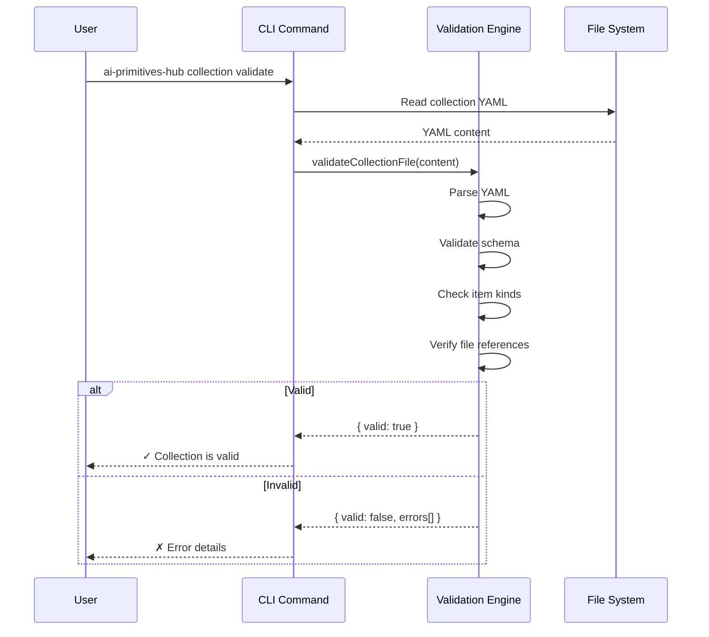
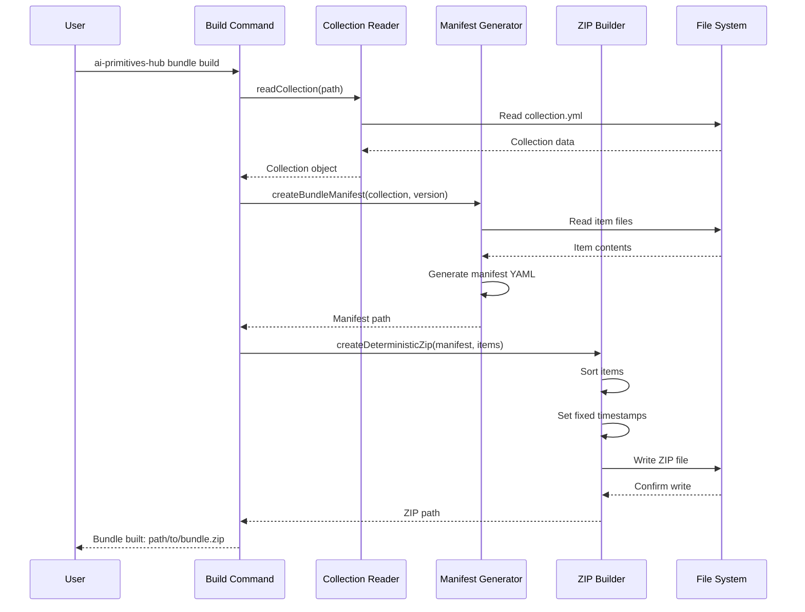
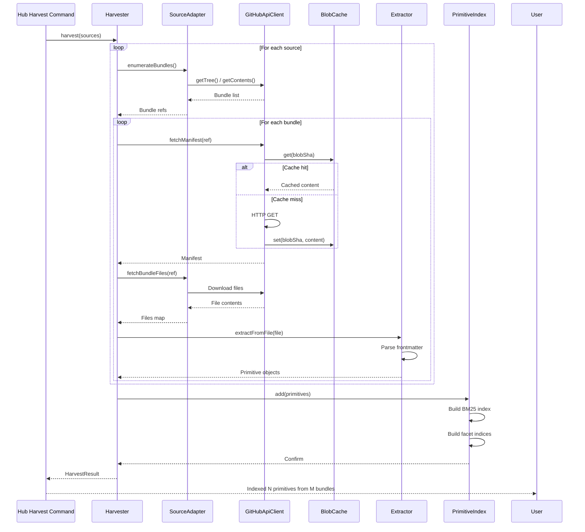
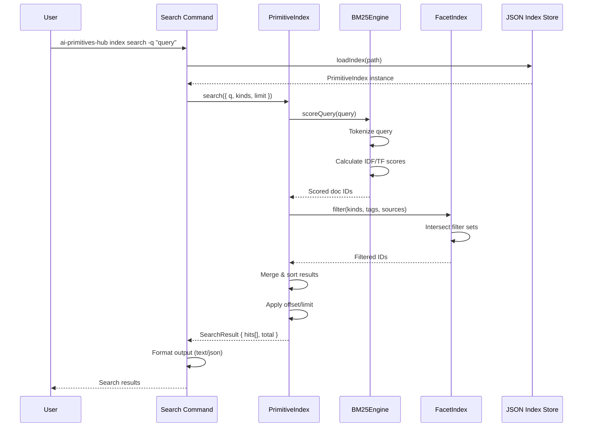
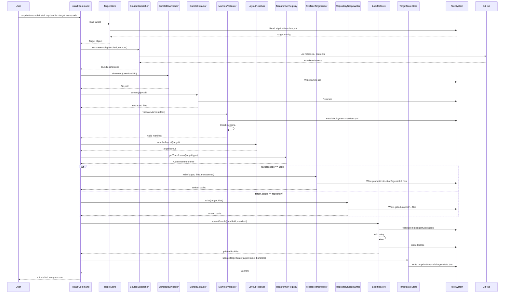
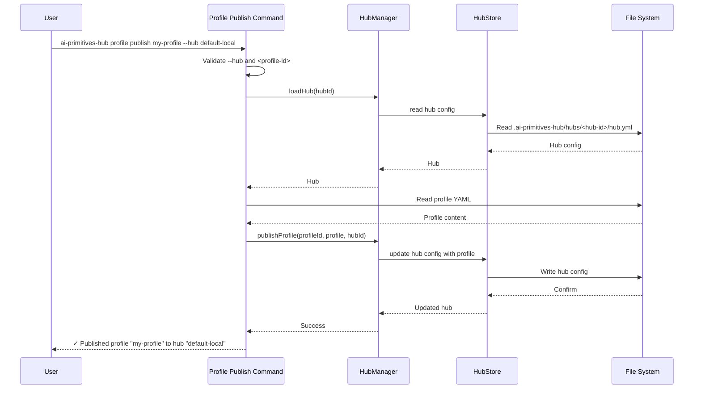
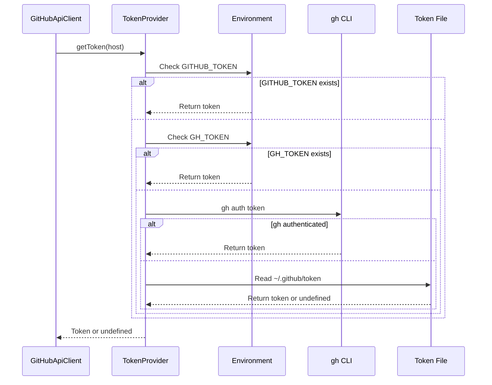
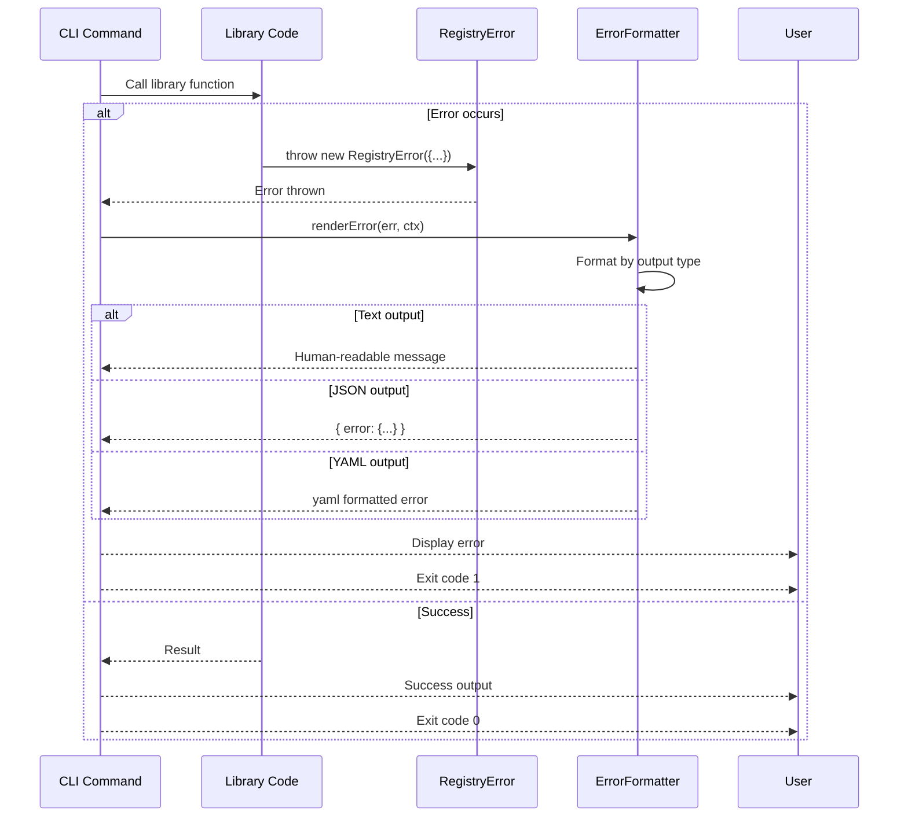

# Key Data Flows

Sequence diagrams showing how data flows through the system for key operations.

## 1. Collection Validation Flow

## 2. Bundle Build Flow

## 3. Primitive Index Harvest Flow

## 4. Search Flow

## 5. Bundle Installation Flow

## 6. Profile Publish Flow

## 7. Token Resolution Flow

## 8. Error Handling Flow

## Performance Characteristics

| Flow | Typical Duration | Bottleneck |
|------|-----------------|------------|
| Collection validation | `<100ms` | YAML parsing |
| Bundle build | 1-5s | File I/O + ZIP compression |
| Cold index harvest | 7-30s | GitHub API calls |
| Warm index harvest | 1-3s | ETag 304 responses |
| Search query | `<10ms` | BM25 scoring (in-memory) |
| Bundle install | `<1s` | File writes |
| Profile publish | `<1s` | Hub config file I/O |
| Token resolution | `<100ms` | `gh` CLI / env reads |

## Error Recovery

| Flow | Failure Mode | Recovery |
|------|--------------|----------|
| Harvest | Network error | Retry with exponential backoff |
| Harvest | Partial failure | Resume from progress log |
| Install | Target not found | Suggest running `ai-primitives-hub target add` |
| Install | Validation fail | Report specific errors |
| Profile publish | Hub not found or profile file missing | Report specific errors |
| Search | Index missing | Suggest running `ai-primitives-hub index harvest` |

## See Also

- [System Context](./system-context.md) — External view
- [Container Diagram](./container.md) — High-level containers
- [Component Diagrams](./component.md) — Detailed internals
