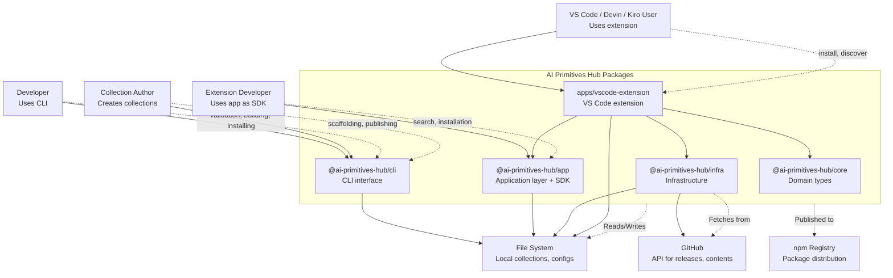

# System Context (Level 1)

The System Context diagram shows the AI Primitives Hub packages as a black box and their relationships with users and external systems.

## Diagram

## Personas

### Developer
Uses the CLI tools for day-to-day operations:
- Validate collection YAML files
- Scaffold collections and primitives (prompts, instructions, agents, skills, plugins, hooks)
- Build and publish bundles
- Search for primitives in hubs
- Install bundles to their development environment

### Collection Author
Creates and maintains prompt collections:
- Uses CLI to scaffold collections and primitives
- Defines collection metadata in YAML
- Creates primitive content (prompts, skills, agents)
- Publishes collections to GitHub releases
- Manages versioning with semantic versioning

### Extension Developer
Integrates the SDK surface into other tools:
- Uses `@ai-primitives-hub/app` exports for search and installation
- Leverages the domain types from `@ai-primitives-hub/core` for type safety
- Builds custom integrations on top of the packages

### VS Code / Devin / Kiro User
Uses the `apps/vscode-extension` package to install and manage primitives from the IDE:
- Browse and install bundles from the marketplace
- Sync bundles to user or repository scope

## External Systems

### GitHub
Primary integration point for:
- **Releases**: Download published collection bundles
- **Contents**: Fetch hub configuration files
- **Trees**: Enumerate repository contents for harvesting
- **Rate Limiting**: Respects GitHub API limits with backoff

### npm Registry
Distribution channel:
- Packages published as `@ai-primitives-hub/core`, `@ai-primitives-hub/infra`, `@ai-primitives-hub/app`, `@ai-primitives-hub/cli`
- The `@ai-primitives-hub/app` package also serves as the public SDK surface until a dedicated `@ai-primitives-hub/sdk` package is needed
- Consumed via `npm install` or workspace protocol in monorepo
- CLI installable via `npm install -g @ai-primitives-hub/cli` (binary `ai-primitives-hub`)
- Supports provenance attestation for supply chain security

### File System
Local storage for:
- **Collections**: YAML files defining primitives
- **Configuration**: `ai-primitives-hub.yml` for targets
- **Cache**: Primitive index and blob cache under `.ai-primitives-hub/`
- **Lockfiles**: `prompt-registry.lock.json` for repository installs (kept for compatibility with the extension)

## User Stories

| As a... | I want to... | So that... |
|---------|-------------|------------|
| Developer | Validate my collection YAML | I catch errors before publishing |
| Developer | Scaffold collections and primitives | I can quickly start creating content |
| Collection Author | Build a deterministic bundle | Users get identical content |
| Extension Developer | Search primitives by keyword | I can recommend relevant prompts |
| Developer | Install a bundle to VS Code | I can use the primitives immediately |
| Collection Author | Detect affected collections on commit | I only publish what changed |

## See Also

- [Codemap](./codemap.md) — Package structure and dependencies
- [Container Diagram](./container.md) — Internal architecture
- [Component Diagrams](./component.md) — Detailed component views
