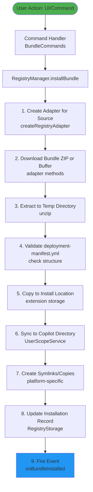
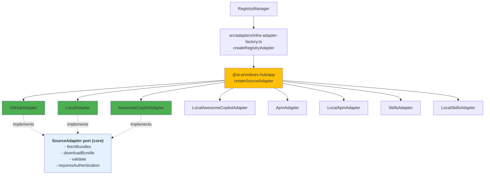
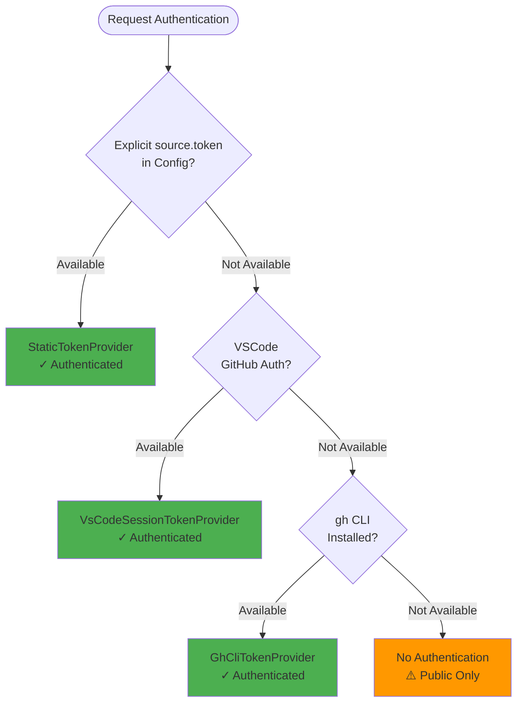
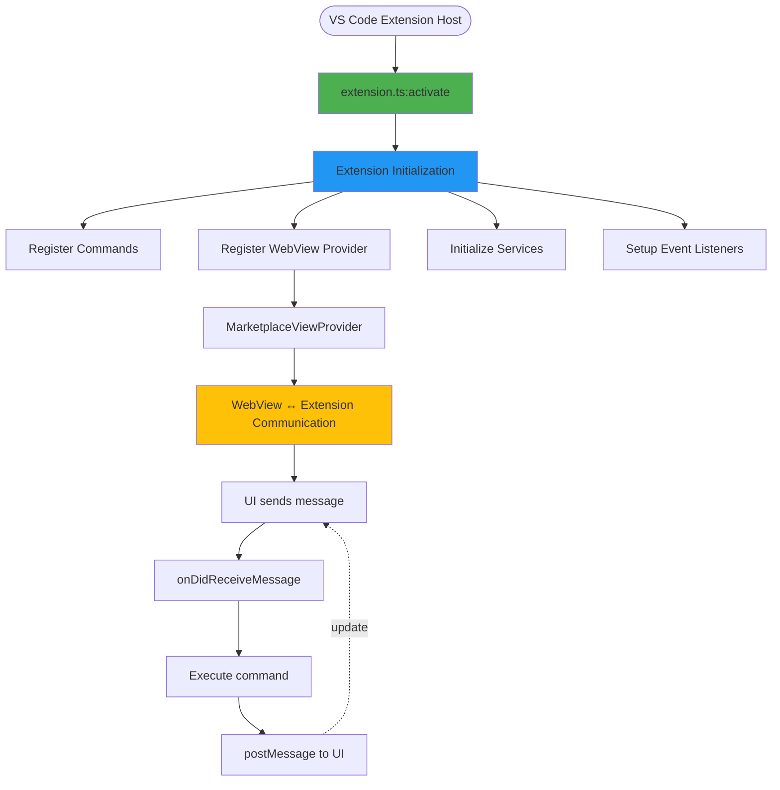

# Developer Guide: Core System Flows

This guide explains the core architectural flows in the AI Primitives Hub extension. Use this as a reference when contributing to or extending the codebase.

---

## Table of Contents

1. [Bundle Installation Pipeline](#1-bundle-installation-pipeline)
2. [Adapter Pattern for Registry Sources](#2-adapter-pattern-for-registry-sources)
3. [Authentication Flow](#3-authentication-flow)
4. [VS Code Extension Integration](#4-vs-code-extension-integration)
5. [Quick Reference](#quick-reference)
6. [Development Tips](#development-tips)

---

## 1. Bundle Installation Pipeline

### Overview

The bundle installation pipeline handles the complete lifecycle from user initiating an install to files being available in both the registry and Copilot.

### Flow Diagram



### Key Files & Components

#### Command Entry Point
**File**: `src/commands/BundleCommands.ts`  
**Purpose**: Handles user commands for bundle operations

```typescript
// Example: Install command
async installBundle(bundleId: string): Promise<void> {
    // Delegates to RegistryManager
    await this.registryManager.installBundle(bundleId, options);
}
```

#### Registry Manager Orchestration
**File**: `src/services/RegistryManager.ts`  
**Purpose**: Orchestrates all registry operations

```typescript
async installBundle(bundleId: string, options: InstallOptions): Promise<InstalledBundle> {
    // Find bundle and source
    // Create appropriate adapter
    // Delegate to installer
    // Update storage
    // Fire events
}
```

#### Bundle Installer
**File**: `src/services/BundleInstaller.ts`  
**Purpose**: Handles two installation methods

```typescript
// Method 1: URL-based installation
async install(bundle: Bundle, downloadUrl: string, options: InstallOptions)

// Method 2: Buffer-based installation
async installFromBuffer(bundle: Bundle, bundleBuffer: Buffer, options: InstallOptions)
```

**URL-based**: Downloads pre-packaged ZIP from remote URL  
**Buffer-based**: Accepts ZIP created dynamically in memory

#### Copilot Sync
**File**: `src/services/UserScopeService.ts`  
**Purpose**: Syncs bundles to GitHub Copilot's native directories

```typescript
// Gets OS-specific Copilot directory
getCopilotPromptsDirectory(): string

// Syncs bundle files
syncBundle(bundleId: string, installDir: string): Promise<void>
```

### Installation Methods

**URL-Based Installation** - `install(bundle, downloadUrl, options)`:
- Used by: `GitHubAdapter`
- Downloads pre-packaged ZIP file from URL
- Flow: Download → Extract → Validate → Install

**Buffer-Based Installation** - `installFromBuffer(bundle, buffer, options)`:
- Used by: `AwesomeCopilotAdapter`, `LocalAdapter`
- Receives ZIP created dynamically in memory
- Flow: Write buffer → Extract → Validate → Install

### Installation Options

```typescript
interface InstallOptions {
    scope: 'user' | 'workspace' | 'repository';  // Installation scope
    force?: boolean;                              // Overwrite existing
    commitMode?: 'commit' | 'local-only';         // For repository scope
}
```

### Repository Scope

For repository-scoped installations:
- Files are placed in `.github/` directories (prompts, agents, instructions, skills)
- MCP servers are merged into `.vscode/mcp.json`
- The lockfile (`prompt-registry.lock.json`) tracks installed bundles
- Local-only mode excludes files via `.git/info/exclude`

See [Installation Flow](./architecture/installation-flow.md) for detailed repository scope documentation.

### Error Handling

The pipeline includes error handling for:
- **Network failures**: Connection errors, timeouts
- **Authentication failures**: 401, 403, token issues
- **Validation failures**: Missing manifest, corrupt ZIP
- **Sync failures**: Permission issues, disk space

All errors are logged to the Output panel under "AI Primitives Hub".

---

## 2. Adapter Pattern for Registry Sources

### Overview

The adapter pattern allows the registry to support multiple source types (GitHub, Local, Awesome Copilot, APM, Skills) through a unified interface. **Concrete adapters live in `packages/infra/src/adapters/` (the `@ai-primitives-hub/infra` package), not in the extension's own `src/adapters/`** — see [Adapter Architecture](./architecture/adapters.md) and [Adapter API Reference](../reference/adapter-api.md) for the full, up-to-date picture; this section is a summary.

### Architecture Diagram



### Key Files & Components

#### Adapter Factory
**File**: `packages/app/src/registry/create-source-adapter.ts`
**Function**: `createSourceAdapter`

```typescript
// Maps a RegistrySource to its concrete infra adapter
export function createSourceAdapter(source: RegistrySource, deps: SourceAdapterFactoryDeps): SourceAdapter {
    switch (source.type) {
        case 'local':
            return new LocalAdapter(source, deps.fs);
        case 'github':
            return new GitHubAdapter(source, buildGitHubApi(buildSourceTokenProvider(source, deps), deps));
        // ... one case per SourceType, GitHub-hosted ones get a per-source CompositeTokenProvider
    }
}
```

One factory, shared by every delivery context — there is no separate per-adapter registration step to run.

#### Extension-Side Wiring
**File**: `src/adapters/infra-adapter-factory.ts`
**Function**: `createRegistryAdapter`

Supplies the Node port implementations (`NodeFileSystem`, `SystemClock`, `NodeHttpClient`, `NodeProcessRunner`) and the extension's GitHub auth fallback chain (`VsCodeSessionTokenProvider` → `GhCliTokenProvider`) that `createSourceAdapter` needs, then calls it. `RegistryManager` calls `createRegistryAdapter`, never `createSourceAdapter` directly.

### Adapter Types

#### GitHubAdapter
**File**: `packages/infra/src/adapters/github-adapter.ts`
**Purpose**: Fetches bundles from GitHub releases

```typescript
async fetchBundles(): Promise<Bundle[]> {
    // Fetches releases from GitHub API
    // Looks for deployment-manifest.yml in assets
}
```

**Features**:
- GitHub API v3 integration (via the injected `GitHubApi` port)
- Release asset scanning
- Manifest cache with explicit `clearManifestCache()` busting
- Authentication via an injected `TokenProvider` (VS Code session → `gh` CLI → explicit token, composed by `createSourceAdapter`)

#### AwesomeCopilotAdapter
**File**: `packages/infra/src/adapters/awesome-copilot-adapter.ts`
**Purpose**: Fetches awesome-copilot collections from GitHub

```typescript
async fetchBundles(): Promise<Bundle[]> {
    // Fetches collection YAML files from GitHub
    // Parses YAML to build bundle metadata
}

async downloadBundle(bundle: Bundle): Promise<Buffer> {
    // Dynamically creates ZIP archive
    // Fetches individual files
    // Returns ZIP buffer
}
```

**Features**:
- GitHub raw content access
- YAML collection parsing
- Dynamic ZIP creation with archiver
- No release requirement
- 5-minute bundle-list cache with explicit `clearCache()` busting

#### LocalAdapter
**File**: `packages/infra/src/adapters/local-adapter.ts`
**Purpose**: Handles local filesystem bundles

```typescript
async fetchBundles(): Promise<Bundle[]> {
    // Scans directory for deployment-manifest.yml files
}
```

**Features**:
- Filesystem access via the injected `FileSystem` port
- Local development support
- file:// protocol support
- Fast iteration

#### LocalAwesomeCopilotAdapter, LocalApmAdapter & LocalSkillsAdapter
**Files**: `packages/infra/src/adapters/local-awesome-copilot-adapter.ts`, `local-apm-adapter.ts`, `local-skills-adapter.ts`
**Purpose**: Local filesystem variants of the AwesomeCopilot, APM, and Skills adapters

#### ApmAdapter & SkillsAdapter
**Files**: `packages/infra/src/adapters/apm-adapter.ts`, `skills-adapter.ts`
**Purpose**: Fetch APM (AI Prompt Manager) packages and GitHub-hosted skills, respectively

### Unified Interface

**File**: `packages/core/src/ports/source-adapter.ts`
**Interface**: `SourceAdapter`

```typescript
export interface SourceAdapter {
    readonly type: string;
    readonly source: RegistrySource;
    
    fetchBundles(): Promise<Bundle[]>;
    downloadBundle(bundle: Bundle): Promise<Buffer>;
    fetchMetadata(): Promise<SourceMetadata>;
    validate(): Promise<ValidationResult>;
    requiresAuthentication(): boolean;
    getManifestUrl(bundleId: string, version?: string): string;
    getDownloadUrl(bundleId: string, version?: string): string;
    forceAuthentication?(): Promise<void>;
}
```

The extension's own `src/adapters/repository-adapter.ts` re-declares this same shape as `IRepositoryAdapter`, used only as `createRegistryAdapter`'s return type at the VS Code boundary.

### Adding a New Adapter

See the [Adapter API Reference](../reference/adapter-api.md) for the full walkthrough (implement `SourceAdapter` in `packages/infra`, wire it into `createSourceAdapter`'s switch statement, extend the `SourceType` union in `packages/core`, add tests in `packages/infra/test/` and `packages/app/test/registry/create-source-adapter.test.ts`).

---

## 3. Authentication Flow

### Overview

Every GitHub-hosted adapter (`GitHubAdapter`, `AwesomeCopilotAdapter`, `ApmAdapter`, `SkillsAdapter`) supports private GitHub repositories through a three-tier authentication fallback chain, resolved once per source by `createSourceAdapter` and injected as a single `TokenProvider` — no adapter hand-rolls its own chain (see [Adapter API Reference § Authentication](../reference/adapter-api.md#authentication) for the up-to-date version of this section).

### Authentication Chain



### Implementation

**Port**: `TokenProvider` (`packages/core/src/ports/http.ts`) — `getToken(host: string): Promise<string | undefined>`
**Composition**: `CompositeTokenProvider` (`@ai-primitives-hub/infra`), built per source by `createSourceAdapter`

```typescript
// packages/app/src/registry/create-source-adapter.ts
function buildSourceTokenProvider(source: RegistrySource, deps: SourceAdapterFactoryDeps): TokenProvider {
    const providers: TokenProvider[] = [];
    if (source.token) {
        providers.push(new StaticTokenProvider(source.token));
    }
    providers.push(...deps.fallbackTokenProviders);
    return new CompositeTokenProvider(providers);
}
```

`CompositeTokenProvider` tries each wrapped provider in order and returns the first resolved token; it has no GitHub-specific knowledge itself. The extension supplies `deps.fallbackTokenProviders` as `[VsCodeSessionTokenProvider, GhCliTokenProvider]` (`src/adapters/infra-adapter-factory.ts`) — each provider is host-aware and simply returns `undefined` for a non-GitHub host, letting the next one in the chain try.

No adapter, old or new, ever sees a `vscode` import or shells out to `gh` itself — that lives entirely in the two `TokenProvider` implementations.

### Token Header Format

```typescript
// GitHub API format used throughout packages/infra/src/adapters/github-adapter.ts
headers['Authorization'] = `token ${token}`;
```

### Token Caching

`GitHubApiClient` (the concrete `GitHubApi` used by every GitHub-hosted adapter) calls `TokenProvider.getToken()` once per request rather than caching the result itself — this lets a provider backed by an expiring/rotating session (e.g. a VS Code auth session) stay correct without any adapter needing its own retry-on-401 logic. If a provider wants to cache internally, that is its own implementation detail behind the same `getToken()` contract.

---

## 4. VS Code Extension Integration

### Overview

The extension integrates with VS Code through commands, WebView UI, and event handlers.

### Integration Flow



### Key Files & Components

#### Extension Activation
**File**: `src/extension.ts`  
**Class**: `PromptRegistryExtension`

```typescript
public async activate(): Promise<void> {
    // Initialize Registry Manager
    await this.registryManager.initialize();
    
    // Register commands
    this.registerCommands();
    
    // Initialize UI components
    await this.initializeUI();
    
    // Register TreeView and Marketplace
    await this.registerTreeView();
    await this.registerMarketplaceView();
    
    // Initialize Copilot Integration
    await this.initializeCopilot();
}
```

#### Marketplace WebView Registration
**File**: `src/extension.ts`  
**Method**: `registerMarketplaceView()`

```typescript
const marketplaceProvider = new MarketplaceViewProvider(
    this.context,
    this.registryManager
);

this.context.subscriptions.push(
    vscode.window.registerWebviewViewProvider(
        'promptregistry.marketplace',
        marketplaceProvider
    )
);
```

#### WebView Message Handler
**File**: `src/ui/MarketplaceViewProvider.ts`  
**Method**: `handleMessage()`

```typescript
private async handleMessage(message: WebviewMessage): Promise<void> {
    switch (message.type) {
        case 'refresh':
            await this.loadBundles();
            break;
        case 'install':
            await this.handleInstall(message.bundleId);
            break;
        case 'update':
            await this.handleUpdate(message.bundleId);
            break;
        case 'uninstall':
            await this.handleUninstall(message.bundleId);
            break;
        case 'openDetails':
            await this.openBundleDetails(message.bundleId);
            break;
        case 'installVersion':
            await this.handleInstallVersion(message.bundleId, message.version);
            break;
        case 'toggleAutoUpdate':
            await this.handleToggleAutoUpdate(message.bundleId, message.enabled);
            break;
        // ... additional handlers
    }
}
```

#### Installation Flow from UI
**File**: `src/ui/MarketplaceViewProvider.ts`  
**Method**: `handleInstall()`

```typescript
private async handleInstall(bundleId: string): Promise<void> {
    await vscode.window.withProgress({
        location: vscode.ProgressLocation.Notification,
        title: `Installing bundle...`
    }, async () => {
        await this.registryManager.installBundle(bundleId, {
            scope: 'user',
            version: 'latest'
        });
    });
    
    // Refresh marketplace to show installed status
    await this.loadBundles();
}
```

#### UI Update via PostMessage
**File**: `src/ui/MarketplaceViewProvider.ts`  
**Method**: `loadBundles()`

```typescript
private async loadBundles(): Promise<void> {
    const bundles = await this.registryManager.searchBundles({});
    const installedBundles = await this.registryManager.listInstalledBundles();
    
    // Enhance bundles with installed status
    const enhancedBundles = bundles.map(bundle => ({
        ...bundle,
        installed: installedBundles.some(ib => ib.bundleId === bundle.id)
    }));
    
    this._view?.webview.postMessage({
        type: 'bundlesLoaded',
        bundles: enhancedBundles
    });
}
```

### WebView Message Protocol

**From UI to Extension**:
```typescript
interface WebviewMessage {
    type: 'refresh' | 'install' | 'update' | 'uninstall' | 'openDetails' |
          'installVersion' | 'getVersions' | 'toggleAutoUpdate' | 
          'openSourceRepository' | 'openPromptFile';
    bundleId?: string;
    version?: string;
    enabled?: boolean;
    installPath?: string;
    filePath?: string;
}
```

**From Extension to UI**:
```typescript
interface ExtensionMessage {
    type: 'bundlesLoaded' | 'bundleDetails' | 'versionsLoaded' | 'error';
    bundles?: Bundle[];
    bundle?: Bundle;
    versions?: string[];
    error?: string;
}
```

### Command Registration

**File**: `src/extension.ts`  
**Method**: `registerCommands()`

Commands are registered through command classes:

```typescript
this.bundleCommands = new BundleCommands(this.context, this.registryManager);
this.sourceCommands = new SourceCommands(this.context, this.registryManager);
this.profileCommands = new ProfileCommands(this.context, this.registryManager);

// Commands are defined in package.json and implemented in command classes
```

**Available Commands**:
- `promptRegistry.scaffoldProject` - Scaffold new collection
- `promptRegistry.validateCollections` - Validate YAML files
- `promptRegistry.createCollection` - Create new collection

---

## Quick Reference

### Common Code Paths

| Task | Entry Point | Key Files |
|------|-------------|-----------|
| Install Bundle | `BundleCommands` | `RegistryManager`, `BundleInstaller`, `UserScopeService` |
| Fetch from GitHub | `GitHubAdapter` | `packages/infra/src/adapters/github-adapter.ts` |
| Fetch Awesome Copilot | `AwesomeCopilotAdapter` | `packages/infra/src/adapters/awesome-copilot-adapter.ts` |
| UI Interaction | `MarketplaceViewProvider` | `MarketplaceViewProvider`, `extension.ts` |
| Add Source Type | `createSourceAdapter` | `packages/app/src/registry/create-source-adapter.ts`, new adapter class in `packages/infra` |

### Test Coverage Goals

**Target Coverage by Component Type**:

- **Adapters**: 80%+ (unit tests with mocking)
- **Pure Utilities**: 100% (no external dependencies)
- **Services with VS Code dependencies**: Integration test focused
- **UI Components**: Manual testing + integration tests

**Run Current Coverage**:
```bash
npm test -- --coverage
```

**Test Organization**:
- `packages/infra/test/adapters/` - Adapter unit tests (Vitest)
- `test/adapters/` - Extension-side adapter wiring tests (`infra-adapter-factory.test.ts`, `vscode-session-token-provider.test.ts`)
- `test/services/` - Service tests
- `test/utils/` - Utility tests
- `test/fixtures/` - Test data

**Key Test Files**:
- `packages/infra/test/adapters/github-adapter.test.ts` - GitHub fetch/download/caching
- `packages/infra/test/adapters/awesome-copilot-adapter.test.ts` - Collection parsing
- `test/adapters/infra-adapter-factory.test.ts` - Per-source-type adapter construction and auth policy
- `collectionValidator.test.ts` - YAML validation

---

## Development Tips

### 1. Debugging Installation Flow

View detailed logs in the Output panel:

1. Open Output: `View → Output`
2. Select **AI Primitives Hub** from dropdown
3. Watch authentication and installation logs

Relevant log messages:
```
[RegistryManager] Installing bundle: testing-automation
[GitHubAdapter] ✓ Using VSCode GitHub authentication
[BundleInstaller] Downloaded bundle to temp
[UserScopeService] Synced to Copilot directory
```

### 2. Testing Adapters

Run adapter tests:
```bash
npm run test:unit
```

Run specific adapter tests:
```bash
npm run test:unit -- --grep "GitHubAdapter"
npm run test:unit -- --grep "AwesomeCopilotAdapter"
```

Use test fixtures in `test/fixtures/` for consistent test data.

### 3. WebView Development

Watch mode for rapid iteration:
```bash
npm run watch
```

Test WebView messages from browser console:
```javascript
vscode.postMessage({ type: 'test', data: 'hello' });
```

### 4. Adding New Commands

1. Define in `package.json`:
```json
{
    "commands": [{
        "command": "promptRegistry.myCommand",
        "title": "My Command",
        "category": "AI Primitives Hub"
    }]
}
```

2. Implement in command class:
```typescript
// src/commands/BundleCommands.ts
async myCommand(): Promise<void> {
    // Implementation
}
```

3. Register in `extension.ts`:
```typescript
vscode.commands.registerCommand('promptRegistry.myCommand', 
    () => this.bundleCommands.myCommand())
```

### 5. Performance Monitoring

Monitor operations using the logger:

```typescript
const startTime = Date.now();
// ... operation ...
logger.debug(`Operation completed in ${Date.now() - startTime}ms`);
```

Key metrics to watch:
- Bundle download time (< 5s target)
- UI render time (< 100ms target)
- Adapter fetch time (< 2s target)

---

## See Also

- [Architecture](./architecture.md) - High-level architecture overview
- [Getting Started](../user-guide/getting-started.md) - Quick start guide for users
- [Testing](./testing.md) - Comprehensive testing guide
- [CONTRIBUTING.md](../../CONTRIBUTING.md) - Contribution guidelines

---

## Contributing

Found an issue or have a suggestion? 
- File an issue: [GitHub Issues](https://github.com/AmadeusITGroup/prompt-registry/issues)
- Submit a PR: [GitHub Pull Requests](https://github.com/AmadeusITGroup/prompt-registry/pulls)

---

**Happy Coding!** 🚀

---

## Extending the System

For detailed guidance on extending specific subsystems:

- **Scaffolding**: See [architecture/scaffolding.md](./architecture/scaffolding.md)
- **Validation**: See [architecture/validation.md](./architecture/validation.md)
- **Adapters**: See [architecture/adapters.md](./architecture/adapters.md)

### Quick Reference

| Extension Type | Key Files | Steps |
|----------------|-----------|-------|
| New Adapter | `packages/infra/src/adapters/`, `packages/app/src/registry/create-source-adapter.ts`, `packages/core/src/domain/source/types.ts` | Implement `SourceAdapter`, wire into the factory switch, extend `SourceType` |
| New Scaffold | `templates/scaffolds/`, `src/commands/ScaffoldCommand.ts` | Create template dir, add manifest.json, update enum |
| New Schema | `schemas/`, `src/services/SchemaValidator.ts` | Create JSON schema, use SchemaValidator |
| New Command | `src/commands/`, `package.json` | Define in package.json, implement handler, register |

